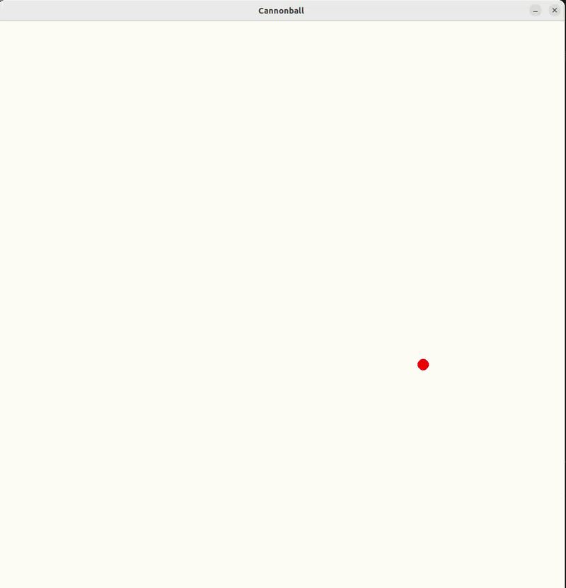

This repo contains the Python implementations of various 10 minute physics simulations.
There are two versions of each simulation:
- A Python version that implements physics from scratch using numpy and using Pygame for visualizations.
- A second Python implementation that leverages Pymunk's Physics engine.

For all simulations present in this repo, we have the following keyboard controls:
- 'R' to reset the simulation.
- 'D' to enter Physics debug mode (for Pymunk versions only)

## To run the cannonball simulation: "python cannonball2d.py" or "python cannonball2d_pymunk.py"
## Demo: 
